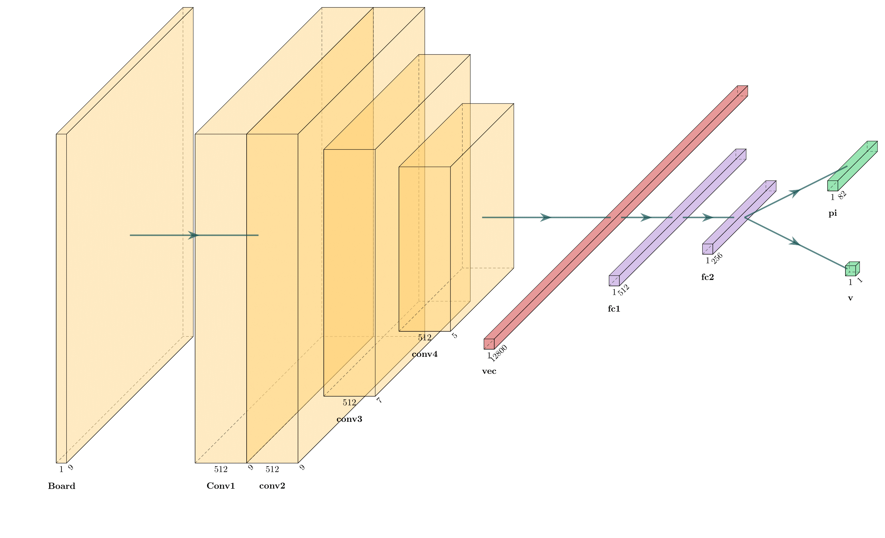
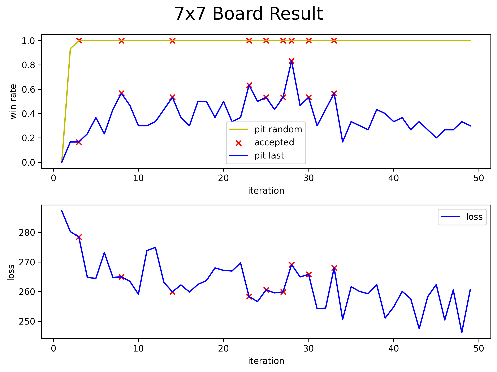
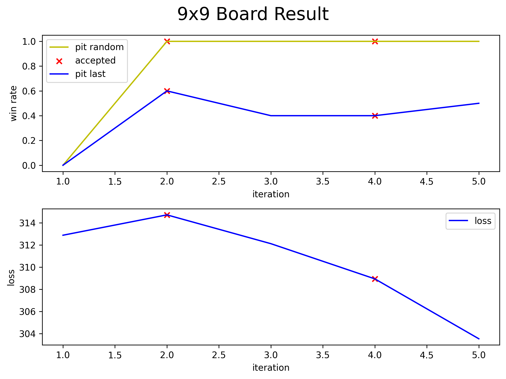

# AlphaZero 报告

## 问题1~4

**问题 1：补全 GoNNet 类**

参考代码演示中的网络结构，网络结构图见问题6。


**问题2：补全 GoNNetWrapper 类，实现损失函数计算**

核心代码摘抄如下：

```python
optimizer = optim.Adam(
    self.nnet.parameters(), 
    lr=net_config.lr,
    weight_decay=1e-4       # 这里是正则项
)
# ...
for epoch in range(net_config.epochs):
    # ...
    optimizer.zero_grad()
    pi, v = self.nnet(boards)
    v = v.reshape(-1)
    loss1 = F.mse_loss(input=v, target=target_vs, reduction='sum')
    loss2 = - torch.sum(target_pis * pi)
    loss =  loss1 + loss2
    loss = loss.sum()
    loss_record.append(float(loss))
    # print("loss: ", float(loss))
    loss.backward()
    optimizer.step()
```

loss 公式为：


* 代码中 loss1 对应公式第一项
* 代码中 loss2 对应公式第二项
* 代码中 weight_decay 对应正则项


**问题3：实现 MCTS 类**

按照论文说明，MCTS 中需要存储 `W(s, a)`、`N(s, a)`、`N(s)` 三个量，计算 PUCT 的其他量可由这三个量导出。

MCTS 的 `search` 函数实现伪代码如下：

* 如果游戏 board 结束，按照胜利与否返回 1/-1
* 未结束，检查当前 MCTS 节点的子结点是否完全被探索
  * 若完全被探索，使用 PUCT 采样出一个子结点，递归 search 这个子结点
  * 若未被完全探索，按照神经网络给出的概率采样一个子结点，使用神经网络判断这个子结点的局势，不再 random playout
* 更新 W、N 的值

详细实现见代码。


**问题4：补全 Trainer 类**

训练时使用如下策略：

* 训练刚开始时，使用当前模型和 Random player 对打，如果胜率显著高于上次胜率的 1.05 倍则接受新模型。当对 Random Player 胜率到达 100% 后不再考虑该策略
* 当前模型和之前最佳模型对打，若当前模型胜率超过 51% 接受当前模型


## 网络结构

> 使用 https://github.com/HarisIqbal88/PlotNeuralNet 辅助绘制




## 训练结果

因为 9x9 棋盘训练实在是太耗时了，所以先训练了更小的棋盘来验证代码正确性

下面图中的 x 表明这次迭代新训练出的模型被接受。


### 5x5 结果


### 7x7 结果




### 9x9 结果

9x9 棋盘中训练一次就需要 1-2 小时时间，过于费时，所以没能训出太多轮




## 训练结果分析

不同棋盘规模下 AlphaZero 都能非常迅速的学习到必胜 Random Player 的策略，但之后想再精进却变得非常困难。

具体表现为：不再接受新模型，loss 开始波动，不再下降

* 5x5 棋盘：30 itr 后出现
* 7x7 棋盘：40 itr 后出现
* 9x9 棋盘：因为 itr 过少，还每能出现该现象

所以不能只使用一套超参数一直一直训练，这样一直 reject 新模型，相当于没有训练。应该在发现 loss 开始波动后立刻更改各种超参数，在原来的基础上继续训练，使 loss 进一步降低。但如何修改这些超参数又是另一个非常困难的问题，学生目前还不具备这种能力，没能进一步训练模型。


## 训练效率问题

本次作业效率瓶颈在 CPU，绘制运行火焰图后发现大部分时间消耗在棋盘操作上，下棋、提子、获取可下位置等操作过于费时。一方面，实现 GoBoard 时为了简化实现，算法复杂度关于棋盘宽度的是 $O(n^3)$ 的，但使用上并查集等数据结构可以把算法优化到 $O(n^2)$。另一方面，Python 本身不善于处理计算复杂的问题，执行效率很低。两方面因素共同导致计算效率过低。

如要改善效率，可以有下面几种方法，但期末周实在是时间有限没能实现：

* 使用 C 实现 GoBoard ，避免使用缓慢的 Python 解释器
* 使用 $O(n^2)$ 的算法实现 GoBoard
* 并行化：在 `collect_single_game` 中可以并行化计算


